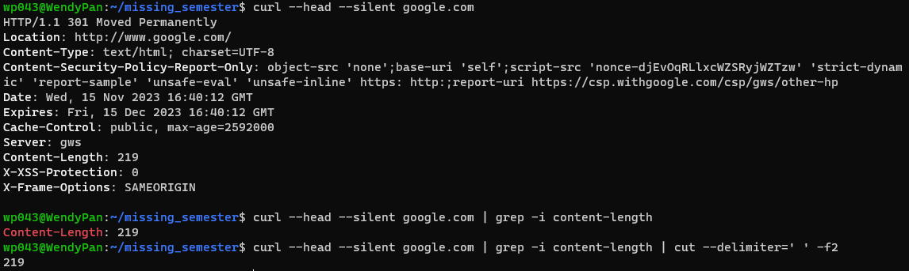
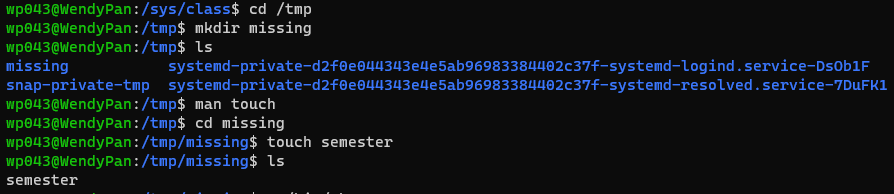
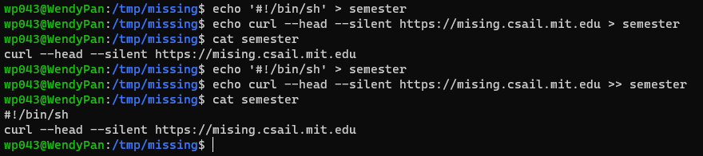
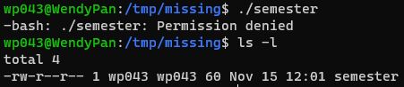
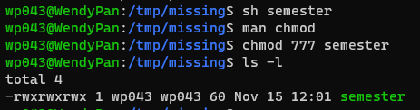
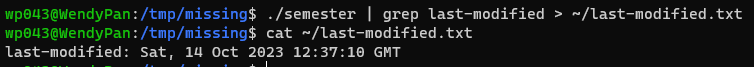
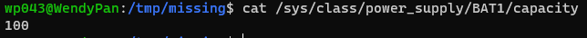

# Missing Semester
## The Shell - textual interface - old school (focus on bash)
<ins>Using the shell</ins>

* ```missing:-$``` tells you are on the machine ```missing``` and that your current working directory is ```~``` (short for home). The ```$``` tells you that you are not the root user.
* At this point we can type a command. eg. ```date```
* A command with arguments: ```echo hello```. ```echo``` simply prints. The shell parses the command by splitting by whitespace. If an argument with whitespace, use ```' '``` or ```" "``` to wrap around. Or escape the relevant character with ```\```. ```echo "hello world"``` is equivalent to ```echo hello\ world```.
* It's essentially writing a small bit of code.
* If the shell is asked to execute a command that doesn't match one of its programming keywords, it consults an environment variable ```$PATH``` that lists which directories the shell should search for programs when it is given a command.
    * ```echo $PATH```: execute the program ```echo```, then searches through the ```:```-separated list of directories in ```$PATH``` for a file by that name. 
    * When it finds it, it runs it.
    * We can find out which file is executed for a given program name using the ```which``` program.
    * We can bypass ```$PATH``` entirely by giving the path to the file we want to execute.

<ins>Navigating in the shell</ins>

* A path is delimited list of directories
    * Separated by ```\``` on Windows
        * There is one root for each disk partition (eg. ```C:\```).
    * Separated by ```/``` on Linux and macOS (main focus)
        * Root of the file system, under which all directories and files lie
        * A file starts with ```/``` is called an absolute path.
        * Any other is relative path - relative to the current working directory, which we can see with ```pwd``` command and change with ```cd``` command.
        * In a path, ```.``` refers to the current directory, and ```..``` to its parent directory.
* To see what lives in a given directory, ```ls```
    * Unless a directory is given as its first argument, ```ls``` will print the contents of the current directory.
    * Most commands accept flags and options that start with ```-``` to modify their behavior.
        * Usually, running a program with the ```-h``` or ```--help``` will print some help text that tells you what flags and options are available.
        * eg. ```ls --help``` tells us other ```-``` that may be used with ```ls``` for some purposes.
        * eg. ```missing:~$ ls -l /home``` returning ```drwxr-xr-x 1 missing users 4096 Jun 15 2019 missing```. 
            * ```d``` at the beginning of the line tells us that ```missing``` is a directory.
            * ```rwx``` indicate what permissions the owner of the file (```missing```), the owning group (```users```), and everyone else respectively have on the relevant item.
            * ```-``` indicates that the given principal does not have the given permission.
            * Above, only the owner is allowed to modify (```w```) the ```missing``` directory.
            * To enter a directory, a user must have "search" (represented by "execute": ```x```) permissions on that directory (and its parents).
            * To list its contents, a user must have read (```r```) permissions on that directory. For files, the permisions are as you would expect.
            * Notice that nearly all the files in ```/bin``` have the ```x``` permission set for the last group, "everyone else", so that anyone can execute those programs.
    * ```mv``` - to rename/move a file
    * ```cp``` - to copy a file
    * ```mkdir``` - to make a new directory
    * More information about a program's arguments, inputs, outputs, or how it works in general, give the ```man``` program a try. It takes as an argument the name of a program, and shows its manual page. Press ```q``` to exit.

<ins>Connecting programs</ins>

* Input stream: when the program tries to read input, it reads from the input stream
* Output stream: when it prints something, it prints to its output stream.
* Normally, a program's input and output are both your terminal. Keyboard = input, screen = output.
* Redirection
    * ```< file``` and ```> file``` rewire the input and output streams of a program to a file respectively.
    
    * ```cat``` is a program that concatenates files. When given file names as arguments, it prints the contents of each of the files in sequence to its output stream. But when ```cat``` is not given any arguments, it prints contents from its input stream to its output stream.
    * Use ```>>``` to append to a file. Good for use of pipes. The ```|``` operator lets you chain programs such that the outupt of one is the input of another.
    
    

<ins>A veresatile and powerful tool</ins>

* The root user is special. It is above (almost) all access restrictions, and can create, read, update, and delete any file in the system.
* Usually won't log into your system as the root user though, since it's too easy to accidentally break something. Instead, use ```sudo``` command.
    * Lets you "do" something "as su" (short for super user, or root). 
    * When you get permission denied errors, it is usually because you need to do something as root.
* Need to be root in order to modify kernel: write to the ```sysfs``` file system mounted under ```/sys```.
    * ```sysfs``` exposes a number of kernel parameters as a file, so that you can easily reconfigure the kernel on the fly without specialized tools. This does not exist on Windows or macOS.
    
    * We ran the command with ```sudo```. Operations like ```|```, ```>```, and ```<``` are done by the **shell**, not by the individual program. ```echo``` does not know about ```|```. They just read from their input and write to their output.
    * In the case above, the shell tries to open the brightness file for writing, before setting that as ```sudo echo```'s output, but is prevented from doing so since the shell does not run as root.
    * One solution: ```echo 3 | sudo tee brightness```
        * ```tee``` takes its input and writes it to a file but also to standard out.
        * ```tee``` is the one to open the ```/sys``` file for writing, and it is running as root, the permissions all work out.
    * Another solution: ```sudo su``` to have a shell as the super user.
* ```#``` intends to run the command as root. ```$``` not on the root.
* gave example of changing scroll-lock LED to lit up for email
* ```xdg-open``` + file name - open a file - replacing finder window

<ins>Exercise</ins>


 ```" "``` has special meaning with ```!``` so we use ```' '``` insead. Note that I mispelled missing but later changed.
 Try to execute the file and consult why it doesn't work by using ```ls -l```

 write the "last modified" dat output by ```semester``` into a file called ```last-modified.txt``` in home directory.
 write a command that reads out your laptop battery's power level or your desktop machine's CPU temperature from ```/sys```. To check CPU's temperature (not on my system), ```cat /sys/class/thermal/thermal_zone0/temp```.
## Editors (Vim)
## Data Wrangling
## Command-line Environment
## Version Control (Git)
## Debugging and Profiling
## Metaprogramming
## Security and Cryptography
## Potpourri